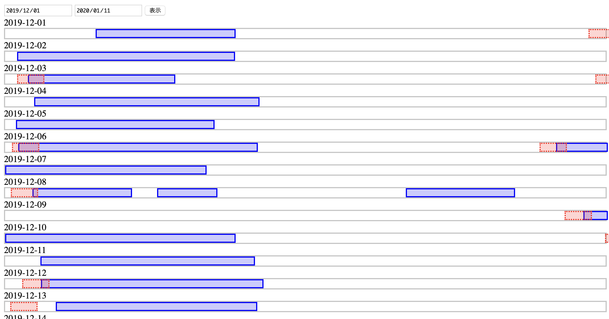

# timeline-log-viewer



Log viewer in chronological way

https://www.fitbit.com/settings/data/export

export data as csv (sleep only)

```
$ node get.js
1585410991.000200,ロゼレム摂取
1585323215.000400,ロゼレム摂取
1585234360.000200,ロゼレム摂取
1584975238.000200,ロゼレム摂取
```

```
node get.js # will generate dst/slack_YYYYMMDD.txt
./format.sh fitbit_export_202001.csv fitbit_export_202002.csv fitbit_export_202003.csv fitbit_export_202004.csv fitbit_export_202005.csv
# data_fitbit/data_merged_YYYYMMDDhhmmss.csv
node gen.js --fitbit-data data_fitbit/data_merged_YYMMDDhhmmss.csv --slack-data dst/slack_YYYYMMDD.txt -s
```
