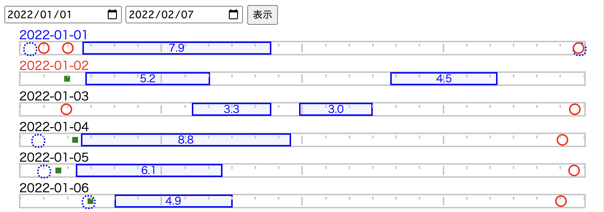

# timeline-log-viewer



Log viewer in chronological way

https://www.fitbit.com/settings/data/export

```
$ node get.js
1585410991.000200,ロゼレム摂取
1585323215.000400,ロゼレム摂取
1585234360.000200,ロゼレム摂取
1584975238.000200,ロゼレム摂取
```

```
node gen.js --fitbit-data data_fitbit/data_merged_20200314170657.csv --slack-data data_slack/slack_out_filtered.txt -s
```
